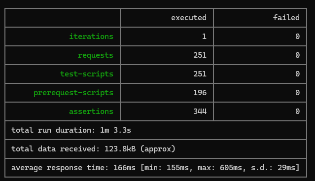
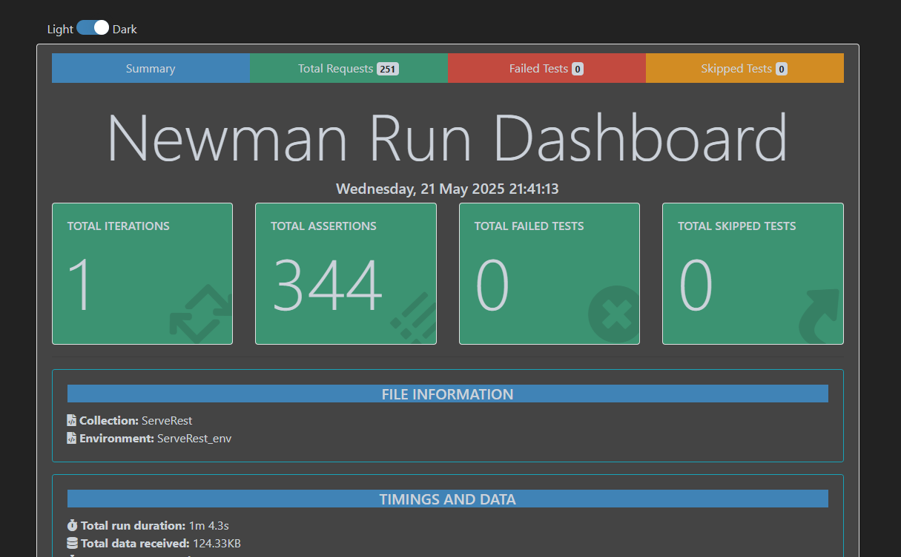
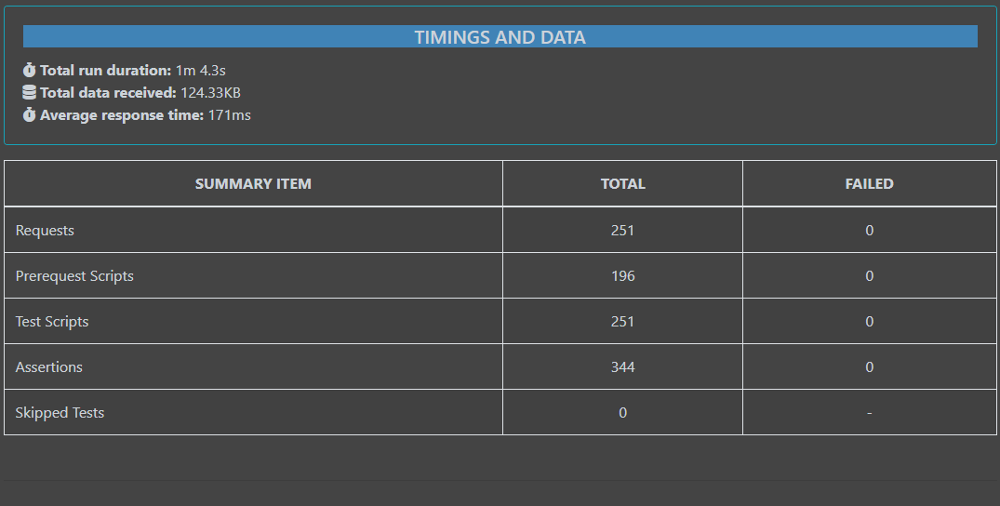

# Projeto ServeRest
Projeto de automação de testes de api via postman, cobrindo os principais cenários de ponta a ponta, envolvendo testes de contrato, validação de responses e statusCode, integrado numa pipeline de CI/CD no github Actions.
O fluxo validado se encontra no [planoDeTeste.md](planoDeTeste.md).

Os cenários seguem um princípio de independência, baseado em pré-request, test e tierdown, evitando crescer o banco de dados.
Obs.: Projeto ainda pendente de refatoração de alguns fluxos, como implementar uma massa variável.

## Tecnologias utilizadas  
- Postman 
- node version v18.16.1  
- newman v5.3.2  
- newman-reporter-html  
- 
## Documentação da API
- Doc da API: [Consulte Swagger](https://serverest.dev/#/)
- 
## Como instalar o ambiente
- Primeiro: instale o node em seu computador [baixe aqui](https://nodejs.org/en/download)
- Segundo: realize a instalação do newman de forma global [baixe aqui a dependencia](https://www.npmjs.com/package/newman)
```
npm install -g newman
```
- Terceiro: realize a instalação da dependencia dos relatórios (opcional) [newman-reporter-html
](https://www.npmjs.com/package/newman-reporter-html)
```
npm install -g newman-reporter-html
```
## Como rodar os testes
### Pelo Postman web ou desktop
- Import a collection e o environment
- Execute os teste de forma manual ou automatizada
### Pelo newman
- Abra o console de preferência, e acesse o diretório com a collection e enviroment
- Execute a seguinte linha de comando para rodar os testes, e visualizar os resultados no cmd
```
newman run ServeRest.postman_collection.json -e ServeRest_env.postman_environment.json -r cli
```
- Execute os teste com relatório
```
npx newman run ServeRest.postman_collection.json -e ServeRest_env.postman_environment.json -r cli,htmlextra
```
### Report
Se você optou por rodar os teste com o report htmlextra, você gerou um arquivo html com o resultado dos testes, e para verificar as validações, basta acessar a pasta newman localizada no diretório da collection.

Report gerado na linha de comando:  
  

Report gerado em html: Exemplo dentro da pasta newman


